# Distributed Systems Exam 🚀

## Table of Contents 📋
1. [Introduction 📜](#introduction)
2. [Project Structure 📁](#project-structure)
   1. [Architecture 🏗️](#architecture)
   2. [Class Diagram 📊](#class-diagram)
   3. [Technologies 🛠️](#technologies)
   4. [Modules 📦](#modules)
3. [Installation and Execution 📦](#installation-and-execution)
4. [Testing microservices ✅](#testing-microservices)
5. [Frontend Module with Angular 🖥️](#frontend-module-with-angular)
7. [Securing the system 🔒](#securing-the-system)
   1. [Setting up Keycloak 🔑](#setting-up-keycloak)
   2. [Setting up security in the microservices 🔒](#setting-up-security-in-the-microservices)
   3. [Setting up security in the frontend module 🔒](#setting-up-security-in-the-frontend-module)
8. [Docker 🐳](#docker)
   1. [Dockerizing the microservices 🐳](#dockerizing-the-microservices)
   2. [Dockerizing the frontend module 🐳](#dockerizing-the-frontend-module)
   3. [Docker Compose 🐳](#docker-compose)

## Introduction 📜
This project is a distributed system that allows the management of resources and reservations. The system is composed of 3 technical microservices (Consul Discovery Service, Consul Config Service, Gateway Service), 2 Operational microservices (Reservation Microservice, Resource Microservice) and Frontend Modules (Angular). The system is developed in Java with Spring Boot and the frontend module is developed in Angular.

## Project Structure 📁
### Architecture 🏗️
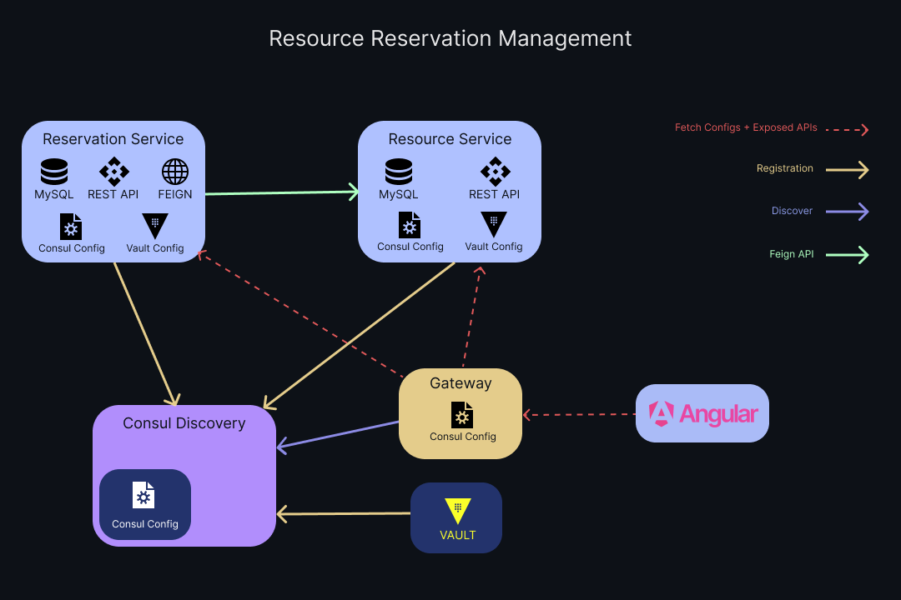

### Class Diagram


### Technologies 🛠️

| Technology                                                                                                               | Descreption                                | 
|--------------------------------------------------------------------------------------------------------------------------|--------------------------------------------|
|  | IDE used in backend development |
|                  | Programming Language used in backend       |
|                 | Dependency Management for Java             |
|  | Framework used in backend                  |
|                        | Database used with microservices           |
|  | Open Source Identity and Access Management |
|             | Service Mesh Solution                      |
|  | Database used with Keycloak                |
|                | Java to HTTP client binder                 |
|  | API Documentation Tools               |
|            | Framework used in frontend                 |
|        | JSON-based open standard for creating access tokens |
|        | API Development Environment                |
|                    | Version Control System                     |
|              | Secrets Management Tool                    |
|  | CSS Framework                              |
|       | Containerization Platform                  |


### Modules 📦
#### Consul Discovery Service 📡
This microservice is responsible for registering the microservices in the Consul service registry.

**Consul Discovery Service UI Test**


#### Gateway 🌐
This microservice is responsible for routing the requests to the corresponding microservice.

**Gateway Service Structure**
```
C:.                                                   
├───main                                              
│   ├───java                                          
│   │   └───com                                       
│   │       └───slimani                               
│   │           └───gatewayservice                    
│   │               │   GatewayServiceApplication.java
│   │               │                                 
│   │               └───security                      
│   │                       SecurityConfig.java       
│   │                                                 
│   └───resources                                     
│           application.properties                       => Configuration to connect to Consul Config Service              
│           application.yml                              => CORS Configuration
```

#### Consul Config Service ⚙️
This microservice is responsible for centralizing the configuration of the microservices.

**Consul Config Service UI Test**


#### Reservation Service 📝
This microservice is responsible for managing the reservations and person. And it communicates with the Resource Service to get the resources.

**Reservation Service Structure**
```
C:.
├───main
│   ├───java
│   │   └───com
│   │       └───slimani
│   │           └───reservationservice
│   │               │   ReservationServiceApplication.java
│   │               │
│   │               ├───controller
│   │               │       ReservationRestController.java
│   │               │       ResourceRestController.java
│   │               │
│   │               ├───dto
│   │               │       ReservationRequestDTO.java
│   │               │       ReservationResponseDTO.java
│   │               │
│   │               ├───entity
│   │               │       Reservation.java
│   │               │
│   │               ├───enums
│   │               │       ResourceType.java
│   │               │
│   │               ├───exceptions
│   │               │       ReservationNotFoundException.java
│   │               │       ResourceNotFoundException.java
│   │               │
│   │               ├───feign
│   │               │       ResourceFeignClientService.java
│   │               │
│   │               ├───mapper
│   │               │       ReservationMapper.java
│   │               │
│   │               ├───model
│   │               │       Resource.java
│   │               │
│   │               ├───repository
│   │               │       ReservationRepository.java
│   │               │
│   │               ├───security
│   │               │       FeignSecurityConfig.java
│   │               │       JwtAuthConverter.java
│   │               │       SecurityConfig.java
│   │               │
│   │               └───service
│   │                       ReservationService.java
│   │                       ReservationServiceImpl.java
│   │
│   └───resources
│           application.properties

```

**Reservation Service Code Snippets Examples**
1. ReservationRestController.java (Short Code Example)
```java
@RestController
@OpenAPIDefinition
@RequestMapping("/resources")
public class ReservationRestController {
   private final ReservationService reservationService;

   public ReservationRestController(ReservationService reservationService) {
      this.reservationService = reservationService;
   }

   // Rest of the code ...

   // Get reservation by id
   @GetMapping("/{id}")
   @PreAuthorize("hasAuthority('ADMIN')")
   public ResponseEntity<ReservationResponseDTO> getReservationById(@PathVariable String id) {
      try {
         return ResponseEntity.ok(reservationService.getReservationById(id));
      } catch (ReservationNotFoundException e) {
         return ResponseEntity.notFound().build();
      }
   }
   
   // Rest of the code ...
}
```
2. ResourceFeignClientService.java (Feign Client)
```java
@FeignClient(name = "resource-service")
public interface ResourceFeignClientService {
    // Save a new Resource
    @PostMapping("/resources")
    Resource saveResource(@RequestBody Resource resource);

    // Get All Resources
    @GetMapping("/resources")
    List<Resource> getResources();

    // Get Resource By Id
    @GetMapping("/resources/{id}")
    Resource getResourceById(@PathVariable String id) throws ResourceNotFoundException;

    // Delete Resource
    @DeleteMapping("/resources/{id}")
    void deleteResource(@PathVariable String id) throws ResourceNotFoundException;

    // Patch Resource
    @PutMapping("/resources/{id}")
    Resource patchResource(@PathVariable String id, Resource resource) throws ResourceNotFoundException;
}
```

#### Resource Service 📝
This microservice is responsible for managing the resources.

**Resource Service Structure**
```
C:.
├───main
│   ├───java
│   │   └───com
│   │       └───slimani
│   │           └───resourceservice
│   │               │   ResourceServiceApplication.java
│   │               │   
│   │               ├───controller
│   │               │       ResourceRestController.java
│   │               │
│   │               ├───dto
│   │               │       ResourceRequestDTO.java
│   │               │       ResourceResponseDTO.java
│   │               │
│   │               ├───entity
│   │               │       Resource.java
│   │               │
│   │               ├───enums
│   │               │       ResourceType.java
│   │               │
│   │               ├───exceptions
│   │               │       ResourceNotFoundException.java
│   │               │
│   │               ├───mapper
│   │               │       ResourceMapper.java
│   │               │
│   │               ├───repository
│   │               │       ResourceRepository.java
│   │               │
│   │               ├───security
│   │               │       JwtAuthConverter.java
│   │               │       SecurityConfig.java
│   │               │
│   │               └───service
│   │                       ResourceService.java
│   │                       ResourceServiceImpl.java
│   │
│   └───resources
│           application.properties
```

**Resource Service Code Snippets Examples**
1. ResourceRestController.java (Short Code Example of patching a resource)
```java
@RestController
@RequestMapping("/resources")
public class ResourceRestController {
    private final ResourceService resourceService;

    public ResourceRestController(ResourceService resourceService) {
        this.resourceService = resourceService;
    }
    
    // Rest of the code ...
   
    // Patch Resource
    @PutMapping("/{id}")
    @PreAuthorize("hasAuthority('ADMIN')")
    public ResponseEntity<ResourceResponseDTO> patchResource(@PathVariable String id, @RequestBody ResourceRequestDTO resourceRequestDTO) {
       try {
          return ResponseEntity.ok(resourceService.patchResource(id, resourceRequestDTO));
       } catch (ResourceNotFoundException e) {
          return ResponseEntity.notFound().build();
       }
    }
    
    // Rest of the code ...
}
```

#### Frontend Module with Angular 🖥️
This module is responsible for the user interface of the system. It introduces a user-friendly interface to manage the resources and reservations.

**Frontend Module Structure**
```
C:.                                                                                                                                                                                                   
├───app                                       
│   │   app-routing.module.ts                 
│   │   app.component.css                     
│   │   app.component.html                    
│   │   app.component.spec.ts                 
│   │   app.component.ts                      
│   │   app.module.ts                         
│   │                                         
│   ├───Components                            
│   │   ├───persons                           
│   │   │       persons.component.css         
│   │   │       persons.component.html        
│   │   │       persons.component.spec.ts     
│   │   │       persons.component.ts          
│   │   │                                     
│   │   ├───reservations                      
│   │   │       reservations.component.css    
│   │   │       reservations.component.html   
│   │   │       reservations.component.spec.ts
│   │   │       reservations.component.ts     
│   │   │                                     
│   │   └───resources                         
│   │           resources.component.css       
│   │           resources.component.html      
│   │           resources.component.spec.ts   
│   │           resources.component.ts        
│   │                                         
│   ├───enums                                 
│   │       resource-type.ts                  
│   │                                         
│   ├───guards
│   │       auth.guard.spec.ts
│   │       auth.guard.ts
│   │
│   ├───models
│   │       person.model.ts
│   │       reservation.model.ts
│   │       resource.model.ts
│   │
│   └───services
│           person.service.spec.ts
│           person.service.ts
│           reservation.service.spec.ts
│           reservation.service.ts
│           resource.service.spec.ts
│           resource.service.ts
│
└───assets
        .gitkeep
        silent-check-sso.html
```

## Installation and Execution 📦
1. Clone the project
```
git clone --recursive https://github.com/Slimani-CE/ds-exam.git
```
2. Import the project in IntelliJ IDEA
3. Download Consul from [here](https://www.consul.io/downloads)
4. Create Consul ``config.json`` configuration file and specify the ``@IP`` of your machine.
```json
{
  "node_name": "consul-server",
  "server": true,
  "bootstrap": true,
  "ui_config": {
    "enabled": true
  },
  "datacenter": "dc1",
  "data_dir": "consul/data",
  "log_level": "INFO",
  "client_addr": "YOUR @IP HERE",
  "bind_addr": "0.0.0.0",
  "advertise_addr": "YOUR @IP HERE",
  "addresses": {
    "http": "0.0.0.0"
  },
  "connect": {
    "enabled": true
  }
}
```
5. Run Consul
```
consul agent -config-file=config.json
```
6. Specify configuration for each microservice
7. Load and Install dependencies using ``mvn clean install`` for each microservice
8. Setup keycloak configuration
9. Run the microservices in the following order:\
   **1. Gateway Service**\
   **2. Resource Service**\
   **3. Reservation Service**\
10. For Angular Frontend; install dependencies using ``npm install --force``

## Testing microservices ✅
| Fetch All Resources                        | Fetch All Reservations                       |  
|--------------------------------------------|----------------------------------------------|
| 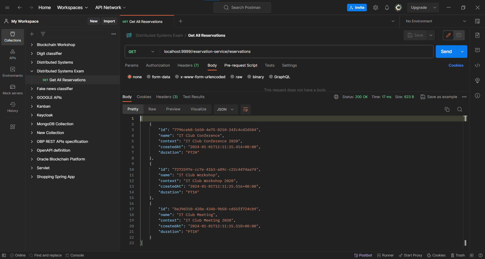   | 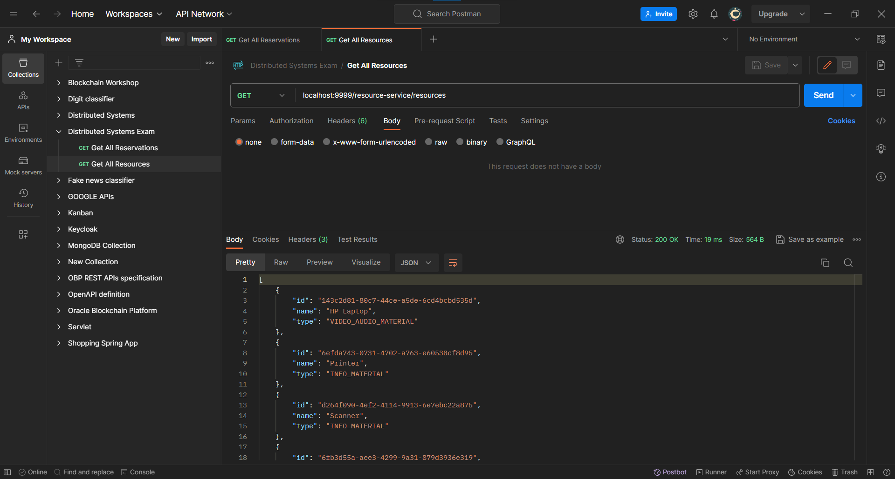  |

## Frontend Module with Angular 🖥️

## Securing the system 🔒
### Setting up Keycloak 🔑
1. Download Keycloak from [here](https://www.keycloak.org/downloads)
2. Start Keycloak using ``bin\kc.bat start-dev`` or ``bin\kc.sh start-dev`` for Linux. Head to [http://localhost:8080](http://localhost:8080) and create account. 

| 3. Create account                               | 4. Login into account                                |
|-------------------------------------------------|------------------------------------------------------|
| 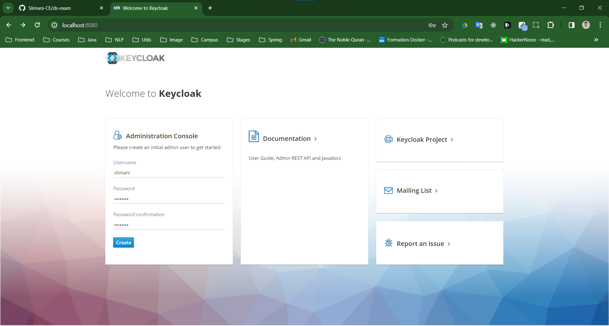 | 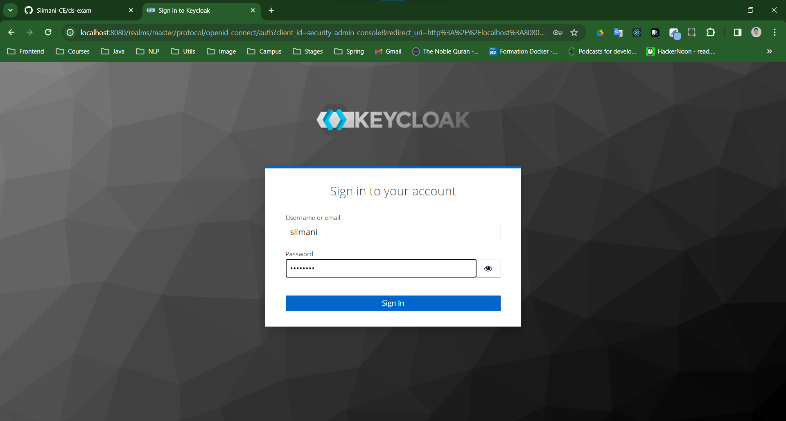 |

| 5. Creating Realm for project                                                                        | 6. Create Client for Reservation Service                                                                                                                                                                          |
|------------------------------------------------------------------------------------------------------|-------------------------------------------------------------------------------------------------------------------------------------------------------------------------------------------------------------------|
| 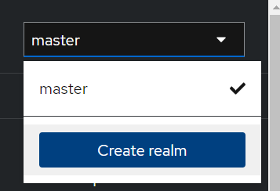  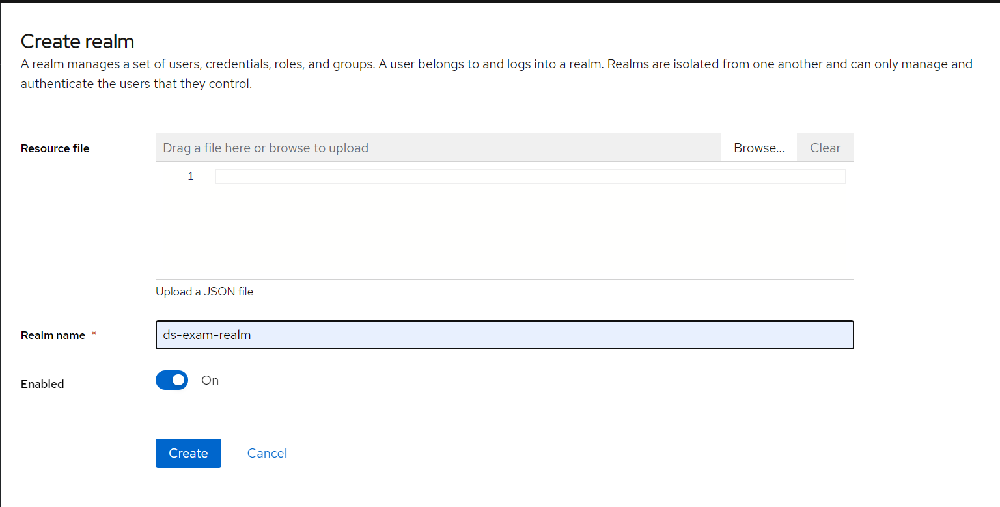 | 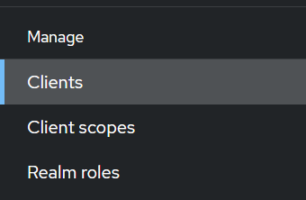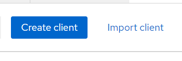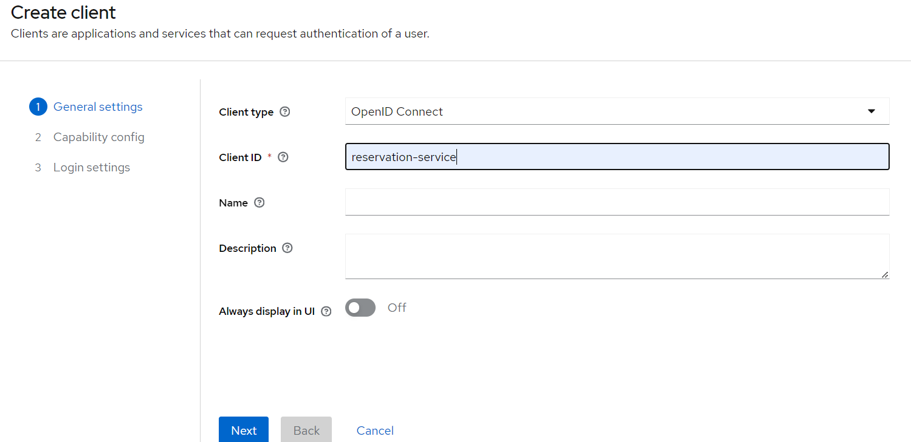 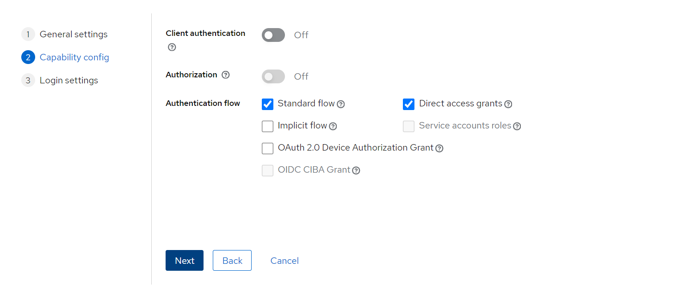 |

